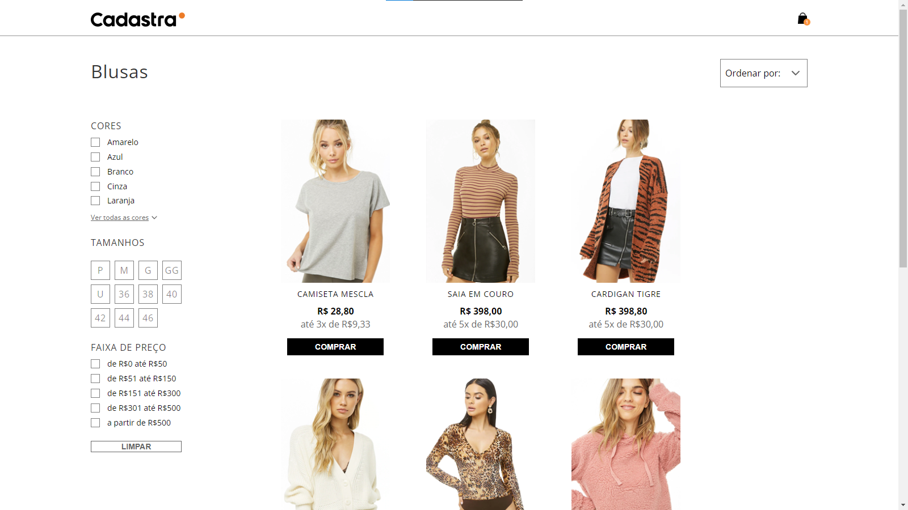
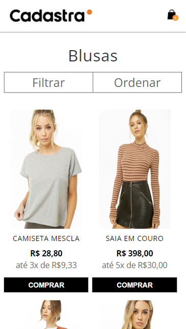

### 🤔 Sobre
Desafio frontend empresa Cadastra

### 📘 Requsitos

- [x] HTML5 e CSS3
- [x] Typescript com clean code
- [x] Requisição a API para obter os produtos
- [x] Filtrar produtos por cor, tamanho e preço.
- [x] Adicionar produto ao carrinho.
- [x] Carregar mais produtos.
- [x] Responsividade

### 🛠 Tecnologias/Ferramentas utilizadas

[react](https://react.dev/) 
[typescript](https://www.typescriptlang.org/) 
[sass](https://sass-lang.com/) 
[json-server](https://github.com/typicode/json-server)
[eslint](https://eslint.org/)
[vite](https://vitejs.dev/) 
[pnpm](https://pnpm.io/pt/) 
[lucide-react](https://lucide.dev/) 

### 🚀 Como executar o projeto

```bash
# Clone o projeto e instale as dependências:
$ npm i, yarn ou pnpm i

# Execute o server + app:
$ npm run start, yarn start ou pnpm start
```
----
### 💻 Versão Web


### 📱 Versão Mobile
